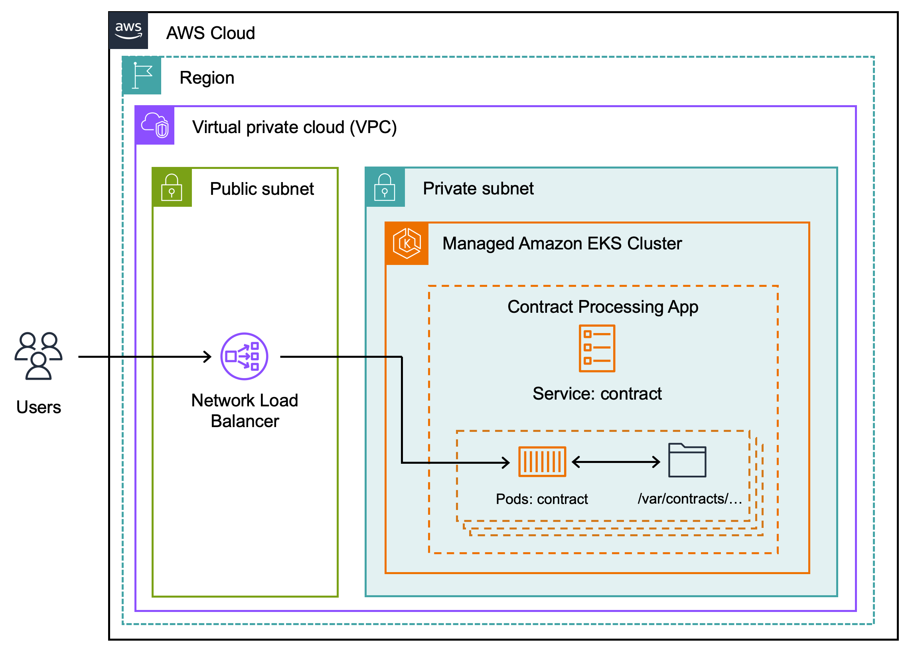
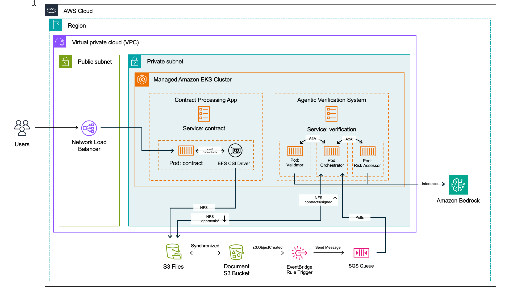

# Build AI Agents on Amazon S3 Files with Amazon EKS

A reference implementation of a **multi-agent contract-processing pipeline** running on
**Amazon EKS**, using **Amazon S3 Files** (S3 buckets exposed as a POSIX/NFS file system
through the **EFS CSI driver**) as the shared data plane between a web application and a
set of AI agents that validate, risk-score, and benchmark contracts using **Amazon Bedrock**.

The core idea: every component reads and writes the *same* contract files at `/var/contracts`.
That path is a shared, ReadWriteMany volume backed by S3 Files, so a file written by the web
app is immediately visible to every agent pod — and is transparently synchronized to a backing
S3 bucket, which in turn drives an event-driven verification workflow.

---

## Table of contents

- [Architecture](#architecture)
- [End-to-end flow](#end-to-end-flow)
- [Components](#components)
- [Repository layout](#repository-layout)
- [Prerequisites](#prerequisites)
- [Deploy](#deploy)
- [Verify the shared mount](#verify-the-shared-mount)
- [Module documentation](#module-documentation)
- [Runbook](#runbook)

---

## Architecture

### Before — application only

The starting point is a contract-processing web app on EKS. Users reach it through a
Network Load Balancer; the contract pods write output under `/var/contracts/…`, but there
is no durable, shared storage layer behind that path.



### After — S3 Files + agentic verification

The shared `/var/contracts` path is backed by **S3 Files** (mounted via the EFS CSI driver).
Files written there are **synchronized to a Document S3 bucket**. Object creation events fan
out through **EventBridge → SQS**, where an **Orchestrator** agent picks them up and coordinates
a **Validator** and **Risk Assessor** (agent-to-agent, "A2A"), each calling **Amazon Bedrock**
for inference. Results are written back to the shared file system (e.g. `contracts/signed/`,
`approvals/`), closing the loop.



---

## End-to-end flow

```
Users
  │  HTTP
  ▼
Network Load Balancer  ──►  contract-frontend (UI)  ──►  contract-app (PHP)
                                                             │  writes contract + approval files
                                                             ▼
                                          /var/contracts  (shared RWX mount)
                                                             │  EFS CSI driver (NFS)
                                                             ▼
                                                   Amazon S3 Files file system
                                                             │  synchronized
                                                             ▼
                                                   Document S3 Bucket
                                                             │  s3:ObjectCreated
                                                             ▼
                                                   EventBridge rule  ──►  SQS queue
                                                                              │  polled
                                                                              ▼
                                                                        supervisor (Orchestrator)
                                                       ┌───────────────┼────────────────┐
                                                       ▼               ▼                ▼
                                                   validator      risk-assessor      benchmark
                                                       │               │                │
                                                       └──── Amazon Bedrock inference ───┘
                                                                       │
                                                                       ▼
                                              results written back to /var/contracts (signed/, approvals/)
                                                                       │
                                                                       ▼
                                                          workflow-streamer (live status to UI)
```

The subtle part that makes this work: **`/var/contracts` is the same physical storage for
every pod.** The web app and all agents mount the one S3 Files-backed PVC, so there is no
copying or message-passing of file contents — only lightweight events telling the agents
that new work has arrived.

---

## Components

| Component            | Kind        | Port | Uses `/var/contracts` | Role |
|----------------------|-------------|------|:---------------------:|------|
| `contract-frontend`  | Deployment + LoadBalancer Service | 3000 | no  | User-facing UI |
| `contract-app`       | Deployment + Service | 80   | **yes** | PHP app; writes contracts & approvals |
| `supervisor`         | Deployment  | —    | **yes** | Orchestrator; polls SQS, coordinates agents |
| `validator`          | Deployment + Service | 8001 | **yes** | Validates contract content (Bedrock) |
| `risk-assessor`      | Deployment + Service | 8002 | **yes** | Scores contract risk (Bedrock) |
| `benchmark`          | Deployment + Service | 8003 | **yes** | Benchmarking agent |
| `workflow-streamer`  | Deployment + Service | 8001 | no  | Streams live workflow status to the UI |

Five workloads mount the shared volume — `contract-app`, `supervisor`, `validator`,
`risk-assessor`, `benchmark`. `contract-frontend` and `workflow-streamer` do not touch the
file system (UI and event streaming only).

---

## Repository layout

```
.
├── README.md                      # this file
├── LICENSE
├── images/                        # architecture diagrams
│   ├── architecture_before.png
│   └── architecture_after.png
├── docs/                          # per-module deep dives
│   ├── 01-storage-layer.md        # S3 Files, StorageClass, PVC, EFS CSI driver
│   ├── 02-contract-app.md         # the web application module
│   ├── 03-agentic-verification.md # supervisor + validator + risk-assessor + benchmark
│   ├── 04-event-pipeline.md       # S3 -> EventBridge -> SQS event flow
│   └── 05-runbook.md              # setup + the real troubleshooting we performed
└── k8s/
    ├── storage/
    │   ├── storageclass.yaml      # s3files-sc (efs.csi.aws.com)
    │   └── pvc.yaml               # s3-contracts-pvc (RWX, 1200Gi)
    └── base/
        ├── contract-app.yaml
        ├── contract-frontend.yaml
        ├── supervisor.yaml
        ├── validator.yaml
        ├── risk-assessor.yaml
        ├── benchmark.yaml
        ├── workflow-streamer.yaml
        └── services.yaml
```

---

## Prerequisites

- An EKS cluster (this reference used `workshop-cluster-s3files` in `us-west-2`).
- The **EFS CSI driver** installed in the cluster (`efs.csi.aws.com`).
- An **Amazon S3 Files** file system with mount targets **in the cluster VPC's subnets**,
  and an access point rooted at the contract data path.
- The cluster security group associated with each mount target (NFS/2049 reachability).
- IAM permissions for pods to call **Amazon Bedrock** and read **SQS** (via IRSA;
  service account `strands-agent-sa`).

> **Account-specific values.** The manifests contain an example account ID, ECR image URIs,
> and an SQS queue URL. Replace `198645490240`, the region, and resource names with your own.

---

## Deploy

```bash
# 1. Storage layer
kubectl apply -f k8s/storage/storageclass.yaml
kubectl apply -f k8s/storage/pvc.yaml
kubectl -n contracts get pvc s3-contracts-pvc   # wait for STATUS=Bound

# 2. Workloads + services
kubectl apply -f k8s/base/

# 3. Confirm rollout
kubectl -n contracts get deploy
```

See [`docs/05-runbook.md`](docs/05-runbook.md) for the full setup path, including the
network fix required when mount targets land in the wrong VPC.

---

## Verify the shared mount

```bash
# All five file-using pods should report nfs4 at /var/contracts
for d in contract-app validator risk-assessor supervisor benchmark; do
  pod=$(kubectl -n contracts get pod -l app=$d -o jsonpath='{.items[0].metadata.name}')
  echo -n "$d: "
  kubectl -n contracts exec "$pod" -- sh -c 'grep " /var/contracts " /proc/mounts | awk "{print \$3}"'
done

# Cross-pod shared write/read
ca=$(kubectl -n contracts get pod -l app=contract-app -o jsonpath='{.items[0].metadata.name}')
val=$(kubectl -n contracts get pod -l app=validator -o jsonpath='{.items[0].metadata.name}')
kubectl -n contracts exec "$ca"  -- sh -c 'echo hello > /var/contracts/.check'
kubectl -n contracts exec "$val" -- sh -c 'cat /var/contracts/.check'   # -> hello
kubectl -n contracts exec "$ca"  -- sh -c 'rm -f /var/contracts/.check'
```

A file written in one pod is readable in every other pod, and appears in the backing S3
bucket within roughly a minute (asynchronous write-back).

---

## Module documentation

- [Storage layer — S3 Files, StorageClass, PVC](docs/01-storage-layer.md)
- [Contract application](docs/02-contract-app.md)
- [Agentic verification system](docs/03-agentic-verification.md)
- [Event pipeline — S3 → EventBridge → SQS](docs/04-event-pipeline.md)

## Runbook

- [Setup and troubleshooting runbook](docs/05-runbook.md)
